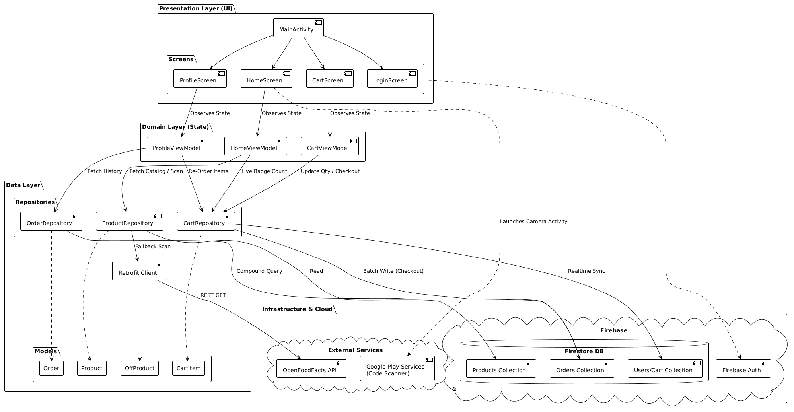

# Scan-to-Order (Android PoC)

A native Android Proof-of-Concept streamlining B2B inventory management via on-device barcode scanning.

## 📱 Project Overview
Designed for field sales reps and store managers to "walk the floor" and restock inventory instantly. By leveraging the physical product barcode as the interface, it eliminates the need to memorize article numbers or navigate complex catalogs.

## 🛠 Tech Stack
*   **Language:** Kotlin
*   **UI:** Jetpack Compose (Material 3)
*   **Architecture:** MVVM + Repository Pattern
*   **Backend:** Firebase (Auth, Firestore)
*   **Hardware:** Google Code Scanner (ML Kit) via Play Services
*   **Networking:** Retrofit (OpenFoodFacts API fallback)

## 🏗 Architecture
The app uses a hybrid data strategy. It prioritizes the internal Firestore catalog for pricing/stock. If a scan is unrecognized, it queries the external OpenFoodFacts API to allow users to request new stock items.

**

## 🚀 Key Features
*   **Hybrid Scanning:** Seamlessly handles internal vs. external products.
*   **Real-time State:** Cart badge and totals update instantly via Firestore Snapshot Listeners.
*   **Serverless:** Full Backend-as-a-Service implementation including Anonymous & Google Auth.
*   **Batch Operations:** Atomic writes for order processing to ensure data integrity.

## ⚠️ Disclaimer
This architecture utilizes client-side pricing logic suitable for a B2B internal tool. For a public production release, logic would be migrated to Google Cloud Functions to prevent price manipulation.
